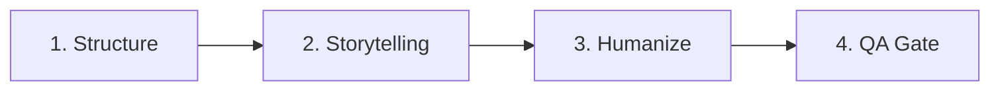

# Tanasub Open

[](LICENSE)

The open, platform-neutral foundation of **Tanasub**: a writing system for planning, drafting, humanizing, and reviewing prose across forms and platforms.

**Tanasub** is pronounced approximately *tuh-NAA-sub*. The name points to proportion, harmony, and meaningful correspondence—the relationships that make writing feel coherent rather than assembled.

## What is Tanasub Open?

Tanasub Open equips AI agents and large language models with a structured, modular system for producing high-caliber prose. Whether generating academic papers, technical documentation, long-form fiction, marketing copy, or personal essays, it replaces generic prompting with field-tested craft conventions, structured templates, and systematic editorial gates.

The guide operates on strict progressive disclosure to keep model context windows lean—loading only the specific layers, genres, or evidence records required for the task. It is fully platform-neutral and runs seamlessly across 12 modern AI platforms and chatbots.

The stable skill identifier remains `universal-writing-guide` so existing platform installations and references continue to work.

A proprietary layer is being developed separately. Tanasub Open is self-contained and does not depend on it.

## Quick Start

### For AI Agents (Cursor, Copilot, Claude Code, Antigravity, etc.)

Point your agent at this repo. It will auto-discover [`SKILL.md`](SKILL.md) (or [`AGENTS.md`](AGENTS.md) / [`CLAUDE.md`](CLAUDE.md)) and follow the router.

If the agent already has the user's genre and tone confirmed:

```
1. Load layers/layer0-academic.md  OR  layers/layer0-blog.md
2. Load genres/{genre}.md  or  subgenres/{subgenre}.md
3. Load tones/{tone}.md  (only if tone was specified)
4. Draft the content
5. Load layers/layer2-humanize.md  →  humanization pass
6. Load layers/layer3-qa-gate.md   →  quality validation
```

### For Chatbots (ChatGPT, Claude, Gemini, etc.)

See the [**Quick Start Guide**](QUICKSTART.md) for step-by-step upload instructions. In short:

1. Upload `SKILL.md` + the layer files matching your writing type to your chatbot's knowledge/project.
2. Optionally upload one genre file and one tone file.
3. Start writing.

For a zero-upload quick start, paste the system prompt from [`platform-adapters/generic-system-prompt.md`](platform-adapters/generic-system-prompt.md) into any chatbot.

## Platform Setup

| Platform | Config Mechanism | Adapter |
|---|---|---|
| Antigravity | Skill directory | [`antigravity.md`](platform-adapters/antigravity.md) |
| Cursor | Project rules (`.cursor/rules/`) | [`cursor-rules.md`](platform-adapters/cursor-rules.md) |
| GitHub Copilot | Repo instructions | [`copilot-instructions.md`](platform-adapters/copilot-instructions.md) |
| Aider | CLI flag (`--read`) | [`aider-conventions.md`](platform-adapters/aider-conventions.md) |
| Claude Code | `CLAUDE.md` | [`claude-code.md`](platform-adapters/claude-code.md) |
| Claude Chat | Projects / attachments | [`claude-chat.md`](platform-adapters/claude-chat.md) |
| Codex CLI | `AGENTS.md` | [`codex-cli.md`](platform-adapters/codex-cli.md) |
| Grok Build | `AGENTS.md` / `.grok/config.toml` | [`grok-build.md`](platform-adapters/grok-build.md) |
| OpenCode | `AGENTS.md` | [`opencode.md`](platform-adapters/opencode.md) |
| OpenHands | `.openhands/microagents/` | [`openhands.md`](platform-adapters/openhands.md) |
| Z.ai | `AGENTS.md` | [`z-ai.md`](platform-adapters/z-ai.md) |
| ChatGPT | Custom GPT / Projects | [`chatgpt-custom-gpt.md`](platform-adapters/chatgpt-custom-gpt.md) |
| Generic LLM | System prompt | [`generic-system-prompt.md`](platform-adapters/generic-system-prompt.md) |

Root [`AGENTS.md`](AGENTS.md) and [`CLAUDE.md`](CLAUDE.md) provide instant zero-config support for autonomous coding agents.

## Architecture

```
├── SKILL.md            # Master entry point and routing tables
├── AGENTS.md           # Universal agent instructions with fast-path
├── CLAUDE.md           # Claude Code configuration with fast-path
├── QUICKSTART.md       # Human-readable guide for chatbot users
├── layers/             # 5 core pipeline stages
│   ├── layer0-academic.md   # Structure: academic, technical, fiction
│   ├── layer0-blog.md       # Structure: blog, marketing, social
│   ├── layer1-storytelling.md  # Hooks, narrative, persuasion
│   ├── layer2-humanize.md   # Contextual voice and humanization
│   └── layer3-qa-gate.md    # Quality validation gate
├── genres/             # 24 genre craft files + _index.md
├── subgenres/          # 8 subgenre craft files + _index.md
├── tones/              # 19 tone cards + _index.md + _combination-rules.md
├── core/               # Methodology, editorial templates, schemas
├── references/         # Evidence dossiers, style catalogs, tone evidence
├── external/           # Vendored humanization patterns
├── platform-adapters/  # Config for 13 AI platforms + _index.md
└── docs/               # Roadmap, coverage tracking, decisions, brand
```

## Four-Phase Pipeline



1. **Structure:** Select [`layer0-academic.md`](layers/layer0-academic.md) or [`layer0-blog.md`](layers/layer0-blog.md) to establish document hierarchy, audience intent, and evidence standards.
2. **Storytelling:** Apply [`layer1-storytelling.md`](layers/layer1-storytelling.md) when the work needs narrative momentum, tension, persuasive hooks, or memorable rhythm.
3. **Humanize:** Use [`layer2-humanize.md`](layers/layer2-humanize.md) for contextual voice calibration, cadence variation, and eliminating artificial tropes—including the requested tone's line in the voice brief and its restraint rules.
4. **QA:** Pass drafts through [`layer3-qa-gate.md`](layers/layer3-qa-gate.md) to enforce structural compliance, factuality, and style integrity. Tone fidelity is checked only when a tone was requested.

> **Token Budget:** Worst-case full pipeline load (Layer 0 + Layer 1 + genre + tone + Layer 2 + Layer 3) is approximately **~8K tokens**.

## Genre Coverage

Comprehensive craft guidance spans [24 genres](genres/_index.md) and [8 subgenres](subgenres/_index.md). All 32 axes have complete chapter coverage (Ch01–15).

## Tone Layer

The Tone Layer adds [19 tones across 5 families](tones/_index.md):

- **Humor:** Comedic, Deadpan, Whimsical, Irreverent
- **Contemplation:** Philosophical, Reflective, Elegiac, Nostalgic
- **Elevation:** Inspirational, Lyrical, Reverent, Warm
- **Gravity:** Grim, Cynical, Urgent, Defiant
- **Candor:** Intimate, Detached, Compassionate

Tone is an orthogonal modifier: it colors the voice but never overrides the genre's emotional engine. Precedence and hybrid patterns live in [`tones/_combination-rules.md`](tones/_combination-rules.md).

## License

Licensed under the [MIT License](LICENSE), except where a file states different terms. Adapted humanization materials are licensed under [CC BY-SA 4.0](https://creativecommons.org/licenses/by-sa/4.0/). Vendored patterns in [`external/fabric-humanize/`](external/fabric-humanize/) retain their original MIT licence. See [`LICENSES/`](LICENSES/) for full texts and scope.

## Contributing

Contributions are welcome. Read [`CONTRIBUTING.md`](CONTRIBUTING.md) for repository scope, evidence and licensing standards, the pull-request workflow, required checks, and private security reporting.

## Architecture Decisions

Key decisions are recorded as ADRs in [`docs/decisions/`](docs/decisions/):

- [ADR-0001](docs/decisions/ADR-0001-tanasub-name.md) — Tanasub naming and scope
- [ADR-0003](docs/decisions/ADR-0003-a3-chatgpt-words-replacement.md) — A3 external acquisition plan amendment
- [ADR-0004](docs/decisions/ADR-0004-tone-layer.md) — Tone Layer: orthogonal voice-attitude guidance

## Brand

See the [Tanasub brand foundation](docs/brand/tanasub-brand-foundation.md) for naming, positioning, and voice.
